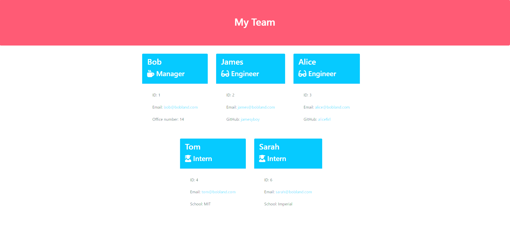

# Team-Profile-Generator

This application takes in information about employees on a software engineering team, then generates an HTML webpage that displays summaries for each person.

## Description

A CLI application written in javascript using node.JS runtime. When run from the command line it will provide users with a series of questions and then generate an HTML file to display their team based on their answers.

## Installation

To use the application, first install node and npm. You will need to install the dependencies in package.JSON using npm.

Once installed, you can run the application by navigating to the folder you have stored the application in and typing 'node index.js' in your command line interface.

## Usage

A series of questions will appear in the command line interface. Answer each question based on your team member's personal details. The html file will then be generated and saved in the 'outputs' folder.

## Credits

https://www.geeksforgeeks.org/node-js-fs-writefile-method/ was useful to understand how to write to a file.

## License

MIT License

Copyright (c) 2023 Thomas Fahy

Permission is hereby granted, free of charge, to any person obtaining a copy
of this software and associated documentation files (the "Software"), to deal
in the Software without restriction, including without limitation the rights
to use, copy, modify, merge, publish, distribute, sublicense, and/or sell
copies of the Software, and to permit persons to whom the Software is
furnished to do so, subject to the following conditions:

The above copyright notice and this permission notice shall be included in all
copies or substantial portions of the Software.

THE SOFTWARE IS PROVIDED "AS IS", WITHOUT WARRANTY OF ANY KIND, EXPRESS OR
IMPLIED, INCLUDING BUT NOT LIMITED TO THE WARRANTIES OF MERCHANTABILITY,
FITNESS FOR A PARTICULAR PURPOSE AND NONINFRINGEMENT. IN NO EVENT SHALL THE
AUTHORS OR COPYRIGHT HOLDERS BE LIABLE FOR ANY CLAIM, DAMAGES OR OTHER
LIABILITY, WHETHER IN AN ACTION OF CONTRACT, TORT OR OTHERWISE, ARISING FROM,
OUT OF OR IN CONNECTION WITH THE SOFTWARE OR THE USE OR OTHER DEALINGS IN THE
SOFTWARE.
